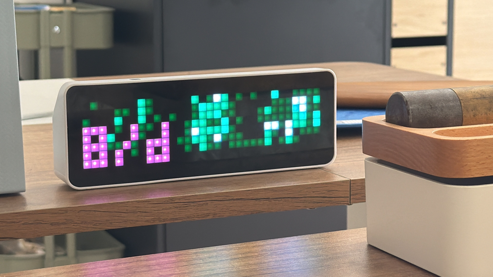

# github-contrib-awtrix

An AWTRIX 3 CustomApp flow for showing GitHub contribution and commit activity
on a Ulanzi pixel display.

[AWTRIX 3](https://github.com/Blueforcer/awtrix3) is custom firmware for the
Ulanzi Smart Pixel Clock TC001 and other matrix-clock builds. This project uses
its local HTTP CustomApp API to render GitHub-style activity grids on the
display. I built it for my desk; it keeps me motivated, and it was a fun excuse
to make a tiny physical status display.



The same renderer can write a PNG preview, which is useful when tuning colors or
checking a graph before pushing it to the display:


## Features

- Show a specific user's GitHub profile contribution calendar.
- Show non-user-specific commit activity for a repository or organization.
- Show commit activity for a bot, agent, or user by exact commit author email.
- Combine an author email with an organization or repository scope.
- Refresh several CustomApps from a private TOML rotation config.
- Run that refresh locally on a schedule, for example with launchd.
- Use GitHub-like colors or custom `matrix`, `green`, `purple`, `yellow`,
  `blue`, and `orange` palettes.
- Optionally overlay velocity as average commits per day.

The Ulanzi/AWTRIX display is 32 x 8 pixels. The graph uses 32 columns for the
last 32 calendar weeks and 7 rows for days of the week; the eighth row is left
blank unless the velocity overlay is enabled.

## Install

From the repo:

```bash
uv sync
uv run github-contrib-awtrix --help
```

Create a private `.env` file:

```env
GITHUB_TOKEN=...
GITHUB_LOGIN=octocat
AWTRIX_URL=http://awtrix_xxxxxx.local
AWTRIX_APP_NAME=github_contribution_graph
AWTRIX_APP_DURATION=7
GITHUB_CONTRIB_COLOR_MODE=github
GITHUB_CONTRIB_VELOCITY=false
```

GitHub's GraphQL API requires a token even for profile calendar requests. For
private repositories or organizations, use a token that can read the relevant
repositories.

## Quick Start

Check GitHub and AWTRIX connectivity:

```bash
uv run github-contrib-awtrix doctor
```

Install the AWTRIX CustomApp page:

```bash
uv run github-contrib-awtrix install
```

Push a profile graph:

```bash
uv run github-contrib-awtrix push \
  --color-mode green \
  --velocity
```

Write local previews while also updating AWTRIX:

```bash
uv run github-contrib-awtrix push \
  --json out/grid.json \
  --terminal \
  --png out/preview.png
```

Show a repository or organization commit graph:

```bash
uv run github-contrib-awtrix push \
  --source commit-search \
  --repo OWNER/REPO \
  --color-mode yellow

uv run github-contrib-awtrix push \
  --source commit-search \
  --org OWNER \
  --color-mode purple
```

Show an author email, optionally scoped to an org or repo:

```bash
uv run github-contrib-awtrix push \
  --source commit-search \
  --author-email bot@example.com \
  --org OWNER
```

Remove the AWTRIX CustomApp page:

```bash
uv run github-contrib-awtrix uninstall
```

## Data Sources

`profile` is the default source and uses GitHub's profile contribution calendar.
It is the right choice when you want the graph to look like a user's GitHub
profile.

`commit-search` counts commits visible to the configured token. It is useful for
repositories, organizations, bots, and agents, but it does not include
profile-only activity such as issues, PRs, reviews, discussions, or co-authored
commits.

## Local Rotation

For a multi-screen display rotation, keep a private TOML config outside the repo:

```bash
mkdir -p ~/.config/github-contrib-awtrix
cp examples/rotation.toml ~/.config/github-contrib-awtrix/rotation.toml
```

Then refresh all configured AWTRIX apps:

```bash
uv run github-contrib-awtrix refresh \
  --config ~/.config/github-contrib-awtrix/rotation.toml
```

The repo includes an hourly launchd example at
`examples/launchd/com.example.github-contrib-awtrix.refresh.plist`. See
[Local scheduled refresh](docs/local-refresh.md) for the config fields,
launchd setup, logs, and frequency changes.

## Outputs

- `push --json` writes 32 x 7 contribution data to stdout.
- `push --json <path>` writes 32 x 7 contribution data to a file.
- `push --terminal` prints a 32 x 8 ANSI color preview.
- `push --png <path>` writes a 32 x 8 PNG preview at 10x scale.
- `push` sends the 32 x 8 frame to AWTRIX over local HTTP.

`push` fetches once, then renders each requested output from the same data.
Preview flags currently belong to `push`, so `AWTRIX_URL` is still required when
writing previews.

## Further Reading

For guides and reference docs, see [docs](docs/README.md).

## Development

```bash
uv run ruff check .
uv run ty check .
uv run pytest
```

## References

- [AWTRIX 3](https://github.com/Blueforcer/awtrix3)
- [AWTRIX 3 API](https://blueforcer.github.io/awtrix3/#/api)
- [GitHub GraphQL API](https://docs.github.com/en/graphql)
- [GitHub commit search API](https://docs.github.com/en/rest/search/search?apiVersion=2022-11-28#search-commits)
